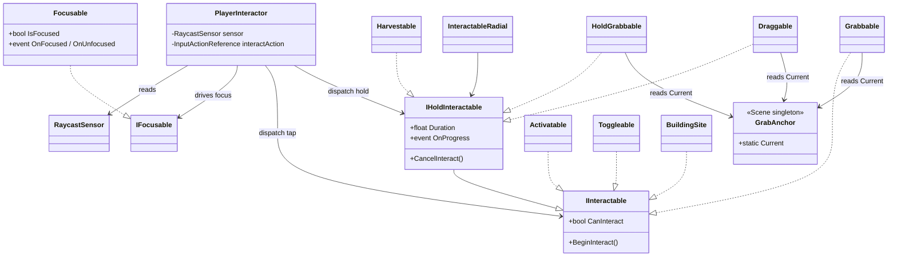

# Interaction — system spec

The player's "look at it, press a key, do something" layer. Detection is a forward raycast, focus is a tiny `IFocusable` contract, and dispatch splits into **tap** (`IInteractable`) and **hold** (`IHoldInteractable`) so every verb's signature describes exactly what it does. Adding a new verb is implementing one of the two contracts.



## What's here

### Glue layer
- **PlayerInteractor** — single script on the player (or camera). Each frame asks the sensor for the nearest hit, flips focus on `IFocusable`, and dispatches the interact key through `IInteractable` / `IHoldInteractable`.
- **RaycastSensor** (in `Sensors/`) — forward raycast with optional sphere radius. `PlayerInteractor` reads `TryGetNearest`.

### Focus contracts
- **IFocusable** — "am I focused right now?" Two members: `IsFocused`, `SetFocused(bool)`.
- **Focusable** — concrete implementation. Fires `OnFocused` / `OnUnfocused` (C# events + UnityEvents) for any UI to react.

### Dispatch contracts
- **IInteractable** — **tap dispatch.** `CanInteract`, `BeginInteract()`. Verb completes on key-down; PlayerInteractor never calls anything else.
- **IHoldInteractable : IInteractable** — **hold dispatch.** Adds `Duration`, `OnProgress`, `CancelInteract()`. PlayerInteractor auto-cancels on key-up, target-change, or focus-loss.

### Tap verbs (`IInteractable`)
- **Activatable** — fire-and-forget. Each press invokes a UnityEvent (`onActivate`). `oneShot` mode disables after the first fire.
- **Toggleable** — binary state. Each press flips `IsOn` and fires the matching UnityEvent (`onToggleOn` / `onToggleOff`).
- **Grabbable** — physics carry, tap-toggle flavor. First tap lifts (anchor-driven follow), second tap throws / drops.
- **BuildingSite** *(in `Building/`)* — domain-specific tap verb. Press completes `Build()`, consumes cost via `ResourceManager`.

### Hold verbs (`IHoldInteractable`)
- **Harvestable** *(in `Resource/`)* — held timer. Key-down starts, release cancels; on completion deposits yield to `ResourceManager` and destroys the prop.
- **HoldGrabbable** — physics carry, sibling of `Grabbable` but hold-flavored. Carry while held; release drops. No throw — different feel from `Grabbable`.
- **Draggable** — physics push along the XZ plane. Hold to push a heavy prop toward where the anchor projects on the ground. Gravity stays on; mass = the heaviness knob.

### Presentation
- **InteractableRadial** — generic UI radial-fill bound to any sibling `IHoldInteractable.OnProgress`. Dropping it on a tap verb is harmless — `GetComponent` returns null and the script does nothing.
- *Domain UIs* (`HarvestableUI`, `BuildingSiteView`) live alongside their respective verbs in `Resource/` and `Building/`.

### Scene singletons
- **GrabAnchor** — transform parented under the camera. Carry / drag verbs read `GrabAnchor.Current`. One per scene; multiple active → last-enabled wins, warning logged.
- **DropSlot** — trigger volume that snaps a specific `Grabbable` into place and fires a UnityEvent / GameEvent. For puzzle-piece placement. Typed to `Grabbable` directly (tap-toggle pickup).

## Dispatch flow

```
each frame in Update:
  ↓
sensor → nearest target
  ↓
focus transitions:
    previous IFocusable → SetFocused(false)
    current  IFocusable → SetFocused(true)
  ↓
TryGetComponent<IInteractable>(out interactable)
  ↓
─── if a hold is in flight ──────────────
   key released? target changed? CanInteract false?
     yes → CancelInteract; clear latch
─────────────────────────────────────────
  ↓
key-down this frame? CanInteract?
  ↓
interactable.BeginInteract()
  ↓
interactable is IHoldInteractable?
  no  → done (tap verb fully handled)
  yes → latch as _currentHold (cancel path watches this from next frame)
```

The verb itself runs whatever state machine it needs in its own `Update` / `FixedUpdate`. PlayerInteractor does not call back into it — it only signals begin and cancel.

## Which verb when

| Desired player feel | Verb |
|---|---|
| Tap to fire a one-off action (lever, doorbell, key pickup) | `Activatable` |
| Tap to flip a binary state (door, light, valve) | `Toggleable` |
| Tap to pick up, tap again to drop / throw — persistent carry | `Grabbable` |
| Tap to do an instant domain-specific verb (build, finalize) | `BuildingSite` (or your own tap verb) |
| Hold N seconds to complete (chop, pick lock, repair) | `Harvestable` (or your own hold verb) |
| Hold to carry, release to drop — tense / fragile feel | `HoldGrabbable` |
| Hold to push a heavy ground-bound object | `Draggable` |

## Composition pattern

A typical interactable prop is three components:

1. **Collider** — on a layer included in `PlayerInteractor`'s `RaycastSensor` mask. The detection surface.
2. **Focusable** + **domain prompt UI** — shows / hides "press E to X" while the player is looking.
3. **One verb component** — `IInteractable` / `IHoldInteractable` implementation. What actually happens on key-down.

Optional fourth, only for hold verbs:

4. **InteractableRadial** — radial-fill progress UI. Binds to `IHoldInteractable.OnProgress` automatically.

Components are independent. A nameplate-only NPC has `Focusable` and no verb. A remote-farmed crop has `Harvestable` and no `Focusable`. The interactor + the contracts don't care.

## Adding a new verb

1. **Decide tap or hold.** Does the player commit on press, or is there a held progression / state-while-held?
   - Tap → implement `IInteractable` (2 members).
   - Hold → implement `IHoldInteractable` (5 members including the inherited tap ones).
2. **Create a `MonoBehaviour`** with the verb's state.
3. **`CanInteract`** = "is this verb available right now?" Wire to whatever gate makes sense (not consumed, has resource, isn't broken, etc).
4. **`BeginInteract`** — start whatever the verb does. For hold verbs, this is "begin the held action," not "complete it."
5. **(Hold only) `CancelInteract`** — undo any partial state from BeginInteract. Reset progress to 0.
6. **(Hold only) Tick progress** in `Update` / `FixedUpdate` and invoke `OnProgress(0..1)` if you want the radial to fill. Call `Complete()` (your own method) when progress reaches 1.
7. **Drop the component** on a prop with a Collider on the sensor's mask + Focusable for the prompt UI.

Optional: if your verb has data that other systems need to read (NPCs, UI, AI), expose it through a parallel verb-data interface (see `IHarvestable`, `IBuildable`). Keeps dispatch and data segregated.

## Why

- **Two interfaces, not one with a Mode flag.** Tap and hold have genuinely different surfaces — tap doesn't need `Duration` / `OnProgress` / `Cancel`; hold doesn't need to pretend those are no-ops. Splitting means each verb's signature describes exactly what it does. `PlayerInteractor` still does one `TryGetComponent` because `IHoldInteractable : IInteractable`.
- **Dispatch is the interactor's job; state is the verb's job.** PlayerInteractor handles key-down/up, focus changes, and target tracking. It knows nothing about resources, building costs, carry physics, or rotation drives. Verbs own their state machines and only see the contract calls.
- **GrabAnchor is shared; verbs are not.** Three verbs (Grabbable, HoldGrabbable, Draggable) read the same anchor abstraction. One transform per scene, multiple verbs reading from it. Adding a fourth carry-style verb is "implement the contract, read `GrabAnchor.Current`."
- **Focus is its own component.** A nameplate NPC is focusable but has no verb. A remotely-farmed crop is harvestable but never gets focus from the player. Keeping focus and verb as separate components keeps both reusable.
- **Generic UI binds to the contract, not the verb.** `InteractableRadial` works for *any* `IHoldInteractable` that fires `OnProgress` — Harvestable today, hold-to-light-beacon tomorrow. No verb-specific UI code per new verb.
- **Class names are preserved across the IInteractable → IInteractable + IHoldInteractable split.** Existing prefabs and scenes reference `Harvestable` / `BuildingSite` / `Grabbable` by class name, so the migration was code-only. No scene re-wiring.

## Constraints

- **One `GrabAnchor` active per scene.** Carry verbs warn if zero active; if multiple are enabled the latest one wins.
- **One `PlayerInteractor` active** (per player at most). Multiple would race over `IFocusable.SetFocused` on shared targets.
- **Carry / drag verbs require a non-kinematic Rigidbody.** `CanInteract` returns false when kinematic — `DropSlot` uses this to lock placed objects in place.
- **Hold verbs that destroy themselves** (e.g. `Harvestable` on completion) must do so cleanly. PlayerInteractor's stale-Object check handles the destroyed-mid-hold case automatically.
- **Carry verbs auto-set `RigidbodyInterpolation.Interpolate`** on pickup and restore the prop's previous setting on release. This is what kills 50 Hz physics jitter when the camera moves smoothly at 144 Hz — without it the prop visually steps once per physics tick.
